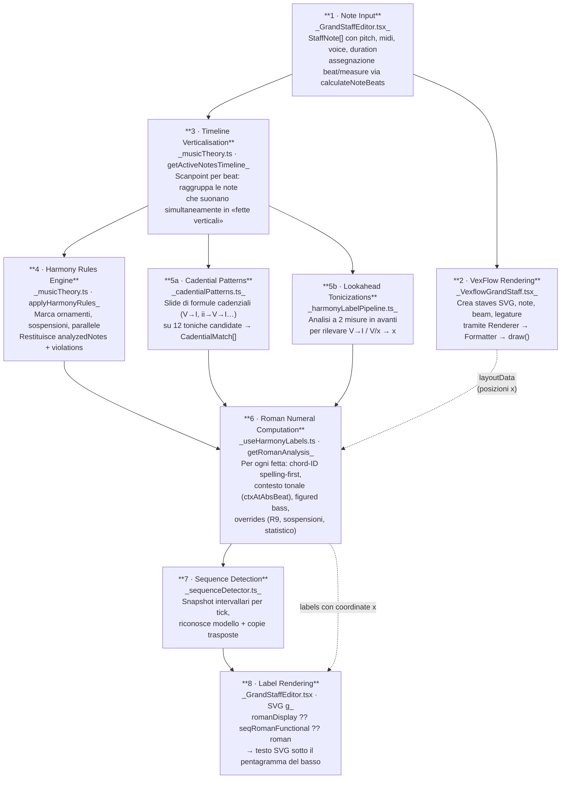

# Harmony Tutor — Pipeline dall'input alla visualizzazione

> Generato il 6 marzo 2026. Diagramma ad alto livello (8 blocchi).

## Diagramma Mermaid



## Legenda

| # | Blocco | File | Descrizione |
|---|---|---|---|
| **1** | Note Input | `src/components/GrandStaffEditor.tsx` | `StaffNote[]` in stato undoable; `calculateNoteBeats` assegna `measureIndex` + `beat` a ogni nota |
| **2** | VexFlow Rendering | `src/components/VexflowGrandStaff.tsx` | `useEffect` crea `Renderer` SVG, disegna staves/note/beam/legature, produce il **layoutData** (coordinate x per ogni beat) |
| **3** | Timeline Verticalisation | `src/utils/musicTheory.ts` · `getActiveNotesTimeline` | Scansiona ogni scanpoint temporale e raggruppa le note che suonano simultaneamente in "fette verticali" `{absBeat, notes[]}` |
| **4** | Harmony Rules Engine | `src/utils/musicTheory.ts` · `applyHarmonyRules` | Il motore principale: identifica ornamenti (passaggio, appoggiatura, ritardo), rileva parallele proibite, restituisce `analyzedNotes` decorati + `violations` |
| **5a** | Cadential Patterns | `src/utils/cadentialPatterns.ts` · `evaluateCadentialPatterns` | Finestra scorrevole di formule cadenziali (V→I, ii→V→I, vii°→I…) testata su 12 toniche candidate → `CadentialMatch[]` che diventano contesti temporanei |
| **5b** | Lookahead Tonicizations | `src/utils/harmonyLabelPipeline.ts` · `computeLookaheadTonicizationOverrides` | Guarda 2 misure avanti per individuare tonicizzazioni (V/x → x) e genera `autoRomanDisplayByAbsBeat` per mostrare pivot labels |
| **6** | Roman Numeral Computation | `src/hooks/useHarmonyLabels.ts` · main `useMemo` | Per ogni fetta verticale: `getRomanAnalysis` (spelling-first), risoluzione contesto tonale via `ctxAtAbsBeat`, figured bass, catena di override (sospensioni, R9:domRes, statistico) → `{roman, figures, x}` |
| **7** | Sequence Detection | `src/utils/sequenceDetector.ts` · `detectVoiceLeadingSequences` | Costruisce snapshot intervallari tick-per-tick, matcha modello + copie trasposte, annota `sequenceRoman` / `sequenceRomanFunctional` sui labels delle copie |
| **8** | Label Rendering | `src/components/GrandStaffEditor.tsx` | Itera `harmonyLabelsBySystemSequenced`, sceglie `romanDisplay ?? seqRomanFunctional ?? seqRoman ?? roman`, renderizza SVG `<text>` con cifre del basso figurato sotto il pentagramma |

## Note sui flussi dati

- **Frecce continue** = passaggio dati diretto (output di un blocco è input del successivo).
- **Frecce tratteggiate** = dipendenze laterali:
  - Il **layoutData** (posizioni x dei beat) prodotto da VexFlow (blocco 2) alimenta il calcolo dei labels (blocco 6) per il posizionamento orizzontale.
  - I **labels completati** (blocco 6→7) tornano al renderer SVG (blocco 8) per la visualizzazione finale.

## File principali coinvolti

| File | Righe | Ruolo |
|---|---|---|
| `src/components/GrandStaffEditor.tsx` | ~8000 | God component: stato, orchestrazione, rendering labels |
| `src/components/VexflowGrandStaff.tsx` | ~1200 | Rendering musicale VexFlow → SVG |
| `src/utils/musicTheory.ts` | ~11000 | Verticalizzazione, analisi armonica, chord-ID, regole |
| `src/hooks/useHarmonyLabels.ts` | ~4200 | Calcolo Roman, figured bass, contesti, override |
| `src/utils/harmonyLabelPipeline.ts` | ~800 | Filtri strutturali, lookahead tonicization |
| `src/utils/cadentialPatterns.ts` | ~500 | Riconoscimento cadenze tramite pattern matching |
| `src/utils/sequenceDetector.ts` | ~600 | Riconoscimento sequenze imitative |
| `src/types.ts` | ~400 | Tipi condivisi: StaffNote, AnalysisContext, TimeSignature |

---

## FASE 2 — Dettaglio del motore di analisi armonica

> Approfondimento dei blocchi 4-6-7 della Fase 1.

### Diagramma Mermaid



```mermaid
flowchart TD
    classDef corpus fill:#ffd966,stroke:#b5851e,color:#333
    classDef decision fill:#d5e8d4,stroke:#6a9a4a,color:#333
    classDef output fill:#dae8fc,stroke:#5b8ec9,color:#333

    %% ═══ INGRESSO ═══
    IN["**StaffNote[]**\n+ timeSignature\n+ keySignature\n+ analysisContexts"]

    subgraph NCT["**① NCT Gate** — applyHarmonyRules · musicTheory.ts"]
        direction TB
        N1["getActiveNotesTimeline\n→ fette verticali per beat"]
        N2{"Nota di passaggio?\nstep→step stesso dir"}
        N3{"Nota di volta?\nstep→return"}
        N4{"Appoggiatura?\nleap→step (beat forte)"}
        N5{"Anticipazione?\nripete nota successiva"}
        N6{"Sfuggita?\nstep→leap dir opposta"}
        N7{"Sospensione?\ntie → step discendente"}
        N8["analyzedNotes\ncon flag isPassing, isNeighbor,\nisAppoggiatura, isSuspension…"]
        N1 --> N2 --> N3 --> N4 --> N5 --> N6 --> N7 --> N8
    end

    subgraph VERT["**② Verticalizzazione** — useHarmonyLabels.ts"]
        direction TB
        V1["structuralNotes()\nfiltra NCT → solo note armoniche"]
        V2["signatureFromNotes()\npitch-class set ordinato"]
        V3["bassPc = nota più grave\n(MIDI sort)"]
        V4{"shouldSuppressAsCompletion?\nbasso invariato + dyad→triad\ndello stesso accordo"}
        V5["analysisNotes\nanalysisNotesForNaming\nfullNotes"]
        V1 --> V2 --> V3 --> V4 --> V5
    end

    subgraph ROMAN["**③ Roman Naming** — useHarmonyLabels.ts"]
        direction TB
        R0["**R0** getRomanAnalysis\nspelling-first chord-ID\n→ root, type, roman, figures"]
        R1{"**R1** vii° rescue?\nfullNotes dà V/tonic?"}
        R2{"**R2** secondary dominant?\nchord è V/x, vii°/x?"}
        R3{"**R3** I7 → V7/IV?\ndominante secondaria"}
        R4["**R4** dyad bass inference\ninferDiatonicRomanFromBass"]
        R5["**R5** shell continuity\nbasso uguale → continua prev"]
        R6["**R6** rootless chord\nbasso su grado → infer roman"]
        R7["**R7–R8** post-inversion\nroot/diatonic correction"]
        R9{"**R9** suspension domRes?\nonset < 3 PC → override\ncon roman risoluzione"}
        R10["**R10** suspDedup\nstesso roman della susp"]
        R11["**R11** sparseRescue\nforza V su basso dominante"]
        R0 --> R1 --> R2 --> R3 --> R4 --> R5 --> R6 --> R7 --> R9 --> R10 --> R11
    end

    subgraph DISP["**④ Display Pipeline** — useHarmonyLabels.ts"]
        direction TB
        D0["**R12** autoOverride\nda applyHarmonyRules"]
        D1["**R13** manualOverride\nuser harmonyOverrides"]
        D2["**D1** cadPivot romanDisplay\nautoRomanDisplayByAbsBeat\nda lookahead tonicization"]
        D3["**D2** nonGlobalPivot\ni=V / I=V display"]
        D4["computeFiguredBassFromNotes\n→ figures: string[]"]
        D5["Contesto tonale\nctxAtAbsBeat → tonic, isMinor\n(user + cadential pattern)"]
        D6[/"**Output label**\n{roman, romanDisplay,\nfigures, symbol, x, absBeat}"/]:::output
        D0 --> D1 --> D2 --> D3
        D4 --> D6
        D3 --> D6
        D5 -.->|"tonica attiva\nper R0"| D6
    end

    subgraph SEQ["**⑤ Sequence Annotation** — sequenceDetector.ts + useHarmonyLabels.ts"]
        direction TB
        S1["detectVoiceLeadingSequences\nsnapshot intervallari\nmatcha modello + copie"]
        S2{"isModulating?\ntrasposizione cromatica?"}
        S3["Annota: sequenceRoman\nsequenceRomanFunctional\nsu labels delle copie"]
        S1 --> S2 --> S3
    end

    subgraph STAT["**⑥ Corpus Statistico** _(predisposto, non ancora attivo)_"]
        direction TB
        ST1["StyleProfile\nchoralStyleProfile.ts"]:::corpus
        ST2["extractStyleProfile()\nfrequenze bigram, moti vocali"]:::corpus
        ST3["useStatisticalCorrection\n(flag per R14:corpusBias)"]:::corpus
        ST1 --> ST2 --> ST3
    end

    %% ═══ CONNESSIONI PRINCIPALI ═══
    IN --> NCT
    NCT --> VERT
    VERT --> ROMAN
    ROMAN --> DISP
    DISP --> SEQ
    SEQ -->|"harmonyLabelsBySystemSequenced"| OUT[/"**Rendering SVG**\nromanDisplay ?? seqRomanFunctional\n?? seqRoman ?? roman"/]:::output
    STAT -.->|"futuro"| ROMAN
```

### Legenda dei sottografi

| # | Sottografo | Descrizione |
|---|---|---|
| **①** | **NCT Gate** | `applyHarmonyRules` scansiona le fette verticali e marca le note non armoniche nell'ordine: passaggio → volta → appoggiatura → anticipazione → sfuggita → sospensione. Output: `analyzedNotes` con flag booleani |
| **②** | **Verticalizzazione** | `structuralNotes()` filtra le NCT, `signatureFromNotes()` crea la firma PC-set, si identifica il basso, e `shouldSuppressAsCompletion` sopprime labels quando un dyad si completa a triad sul medesimo accordo |
| **③** | **Roman Naming** | Catena di 15 step (R0–R14) che parte da `getRomanAnalysis` (spelling-first) e applica rescue, correzioni, dominanti secondarie, sospensioni, override automatici/manuali e bias statistico |
| **④** | **Display Pipeline** | Prepara `romanDisplay` (pivot labels per tonicizzazioni), figured bass, e risolve il contesto tonale attivo (`ctxAtAbsBeat`) |
| **⑤** | **Sequence Annotation** | Il detector trova pattern ripetuti; se la sequenza è modulante (trasposizione cromatica esatta), annota `sequenceRomanFunctional` che ha priorità sul `roman` nel rendering |
| **⑥** | **Corpus Statistico** | `StyleProfile` in `choralStyleProfile.ts`: collegato alla catena via R14 (bigram). Attivabile da preferenze. In giallo nel diagramma |

### Catena di override Roman (R0→R14)

| Step | Tag | Condizione | Effetto |
|---|---|---|---|
| R0 | `getRoman` | sempre | Prima analisi spelling-first |
| R1 | `viiRescue` | fullNotes dà V e roman è vii°/iii ambiguo | Preferisce V |
| R2 | `secDom` | accordo è V/x o vii°/x | Assegna dominante secondaria |
| R3 | `I7` | I7 con 7ª → V7/IV | Riclassifica come secondaria |
| R4 | `dyadBass` | solo 2 PC, basso su grado diatonico | Inferisce roman dal basso |
| R5 | `shellCont` | basso invariato, stesso contesto, 2 PC | Continua il roman precedente |
| R6 | `rootless` | 2 PC, basso su grado non-root | Inferisce accordo rootless |
| R7–R8 | `postInv*` | inversione con root/diatonic correction | Corregge l'inversione |
| R9 | `domRes` | sospensione, onset < 3 PC, risoluzione è V | Override con roman risoluzione |
| R10 | `suspDedup` | sospensione, stesso roman del beat precedente | Sopprime duplicato |
| R11 | `sparseRescue` | nessun roman, basso su dominante | Forza V |
| R12 | `autoOvr` | override automatico da applyHarmonyRules | Sovrascrive |
| R13 | `manualOvr` | override manuale dell'utente | Sovrascrive (priorità massima) |
| R14 | `corpusBias` | `useStatisticalCorrection` ON, 2 candidati con score ravvicinato (< soglia) | Usa bigram `P(cand \| prev)` dal corpus per disambiguare |

### Priorità di visualizzazione

```
romanDisplay ?? sequenceRomanFunctional ?? sequenceRoman ?? roman
```

1. `romanDisplay` — pivot labels (i=V, V/vi, etc.) da lookahead/cadential
2. `sequenceRomanFunctional` — roman normalizzato dal modello di sequenza
3. `sequenceRoman` — roman grezzo dal modello di sequenza
4. `roman` — il Roman calcolato dalla catena R0–R14

---

## FASE 3 — Realizzatore di Corali

Il realizzatore genera note SATB a partire da una progressione di numeri romani con cifrature,
ed è il pipeline inverso rispetto all'analisi (genera note anziché etichette).

### Diagramma Mermaid



```mermaid
flowchart TD
    classDef input fill:#4CAF50,color:#fff
    classDef engine fill:#2196F3,color:#fff
    classDef cost fill:#FF9800,color:#fff
    classDef corpus fill:#FFC107,color:#333
    classDef output fill:#9C27B0,color:#fff

    subgraph INPUT["Input utente"]
        UI["RomanProgressionEditor\n(UI: Roman + figures + basso dato)"]:::input
        OPTS["RealizationOptions\n(tonica, modo, armatura, TS)"]:::input
    end

    subgraph SCALE["Costruzione scala"]
        BS["buildScale(tonic, isMinor)\n→ 7 ScaleDegreeNote"]:::engine
        CH["chordForDegree(degree, inv, seventh)\n→ set di PC + root"]:::engine
    end

    subgraph SEARCH["Ricerca candidati"]
        ENUM["Enumerazione voci\n(SATB range constraints)"]:::engine
        CAND["Generazione combinazioni\n(tutte le assegnazioni SATB valide)"]:::engine
    end

    subgraph COSTFN["Funzione di costo"]
        C1["Regole hard:\n- range vocale\n- spacing (max 8va tra S-A, A-T)\n- no unisoni interni"]:::cost
        C2["Penalità soft:\n- 5e/8e parallele\n- moto contrario preferito\n- raddoppio 3a penalizzato\n- sensibile non raddoppiata"]:::cost
        C3["Bonus da corpus:\n- getInversionBonus\n- getMotionBonus\n- getContraryMotionBonus"]:::corpus
    end

    subgraph SELECT["Selezione"]
        BEST["Best-first: beat per beat\n(costo cumulativo minimo)"]:::engine
        BEAM["Beam width = 8\n(mantiene N candidati per beat)"]:::engine
    end

    subgraph OUTPUT["Output"]
        NOTES["StaffNote[] SATB\n(con id ch_*, midi, pitch,\naccidental, noteIndex)"]:::output
    end

    UI --> OPTS
    OPTS --> BS
    BS --> CH
    CH --> ENUM
    ENUM --> CAND
    CAND --> C1
    C1 --> C2
    C2 --> C3
    C3 --> BEST
    BEST --> BEAM
    BEAM --> NOTES
```

### Entry point

| Funzione | File | Ruolo |
|---|---|---|
| `realizeProgression()` | `choralRealization.ts` | Funzione principale: prende la progressione e ritorna `StaffNote[]` |
| `RomanProgressionEditor` | `RomanProgressionEditor.tsx` | UI: assembla le opzioni e chiama `realizeProgression` |

### Flusso di elaborazione

1. **`buildScale(tonic, isMinor)`** — Costruisce le 7 note diatoniche (`ScaleDegreeNote[]`), ciascuna con lettera, accidental (`''`, `'#'`, `'b'`), semitoni dalla tonica e grado.

2. **`chordForDegree(degree, inv, seventh)`** — Dato un grado (es. V), l'inversione (0/1/2/3) e il tipo di settima, genera l'insieme di pitch class dell'accordo e la root.

3. **Enumerazione candidati** — Per ogni beat, enumera tutte le combinazioni SATB entro i range vocali:
   - Soprano: C4–G5
   - Alto: G3–D5
   - Tenore: C3–G4
   - Basso: E2–D4 (o dato dall'utente in basso dato)

4. **Funzione di costo** — Ogni combinazione viene valutata:

   | Vincolo | Tipo | Peso |
   |---|---|---|
   | Fuori range vocale | Hard (scarta) | ∞ |
   | Spacing > 8va (S-A, A-T) | Hard | ∞ |
   | Incrocio di voci | Hard | ∞ |
   | 5e/8e parallele | Penalità | alto |
   | Moto contrario assente | Penalità | medio |
   | Raddoppio della 3a | Penalità | medio |
   | Salto > 4a in voce interna | Penalità | basso |
   | Risoluzione sensibile mancante | Penalità | medio |
   | **Bonus inversione (corpus)** | Bonus | `getInversionBonus()` |
   | **Bonus moto vocale (corpus)** | Bonus | `getMotionBonus()` |
   | **Bonus moto contrario (corpus)** | Bonus | `getContraryMotionBonus()` |

5. **Selezione beam-search** — Mantiene le migliori 8 soluzioni parziali per ogni beat. Alla fine, la soluzione con il costo cumulativo più basso viene scelta.

6. **Generazione note** — Le `VoiceAssignment` selezionate vengono convertite in `StaffNote[]` con tutti i campi popolati (id `ch_*`, midi, pitch, octave, accidental, noteIndex, etc.).

### Integrazione con il Corpus (StyleProfile)

Il corpus influenza il realizzatore (non l'analisi) quando il toggle "Correzione statistica" è attivo:

- **`getInversionBonus(profile, degree, inv)`** — premia inversioni frequenti nel corpus per un dato grado (es. I in fondamentale: +bonus; I in 2° rivolto: penalità relativa).
- **`getMotionBonus(profile, voice, motionType)`** — premia il tipo di moto (step, skip, leap) più frequente per ogni voce.
- **`getContraryMotionBonus(profile)`** — premia il moto contrario tra S e B se la proporzione nel corpus lo supporta.

Tutti i bonus sono scalati da `confidenceWeight(sampleCount)`: con pochi dati il corpus ha peso ~0, con ≥50 campioni peso 1.

### Progression Suggester

| File | Ruolo |
|---|---|
| `progressionSuggester.ts` | Suggerisce il prossimo accordo in base a bigram/trigram |

Usato solo nella **UI** di `RomanProgressionEditor` per l'autocomplete — non influenza la generazione delle voci. Fonti: bigram estratti dal corpus + regole comuni (V→I, IV→V, etc.).

### File principali

| File | Contenuto |
|---|---|
| `src/engine/choralRealization.ts` | Motore di realizzazione SATB |
| `src/engine/choralStyleProfile.ts` | Profilo statistico (inversioni, moti, bigram) |
| `src/engine/progressionSuggester.ts` | Suggeritore di progressioni |
| `src/engine/defaultStyleProfile.json` | Profilo corpus pre-costruito (67 file) |
| `src/components/RomanProgressionEditor.tsx` | UI editor progressioni |
| `scripts/buildDefaultStyleProfile.ts` | Script di build del corpus |
